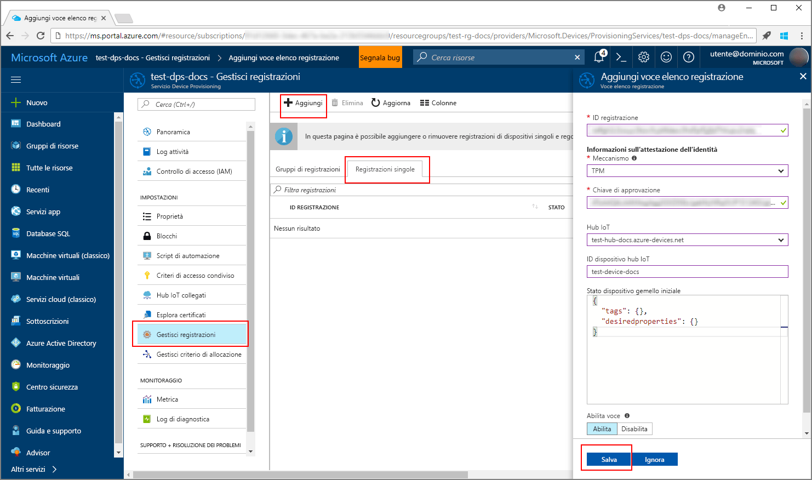
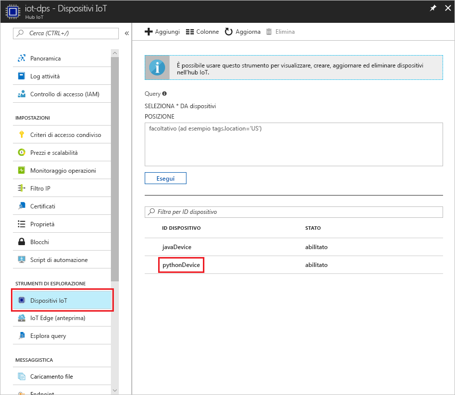

# <a name="create-and-provision-a-simulated-tpm-device-using-python-device-sdk-for-iot-hub-device-provisioning-service"></a>Creare ed effettuare il provisioning di un dispositivo simulato TPM usando l'SDK per dispositivi Python per il servizio Device Provisioning in hub IoT

[!INCLUDE [iot-dps-selector-quick-create-simulated-device-tpm](../../includes/iot-dps-selector-quick-create-simulated-device-tpm.md)]

Questi passaggi illustrano come creare un dispositivo simulato nel computer di sviluppo che esegue un sistema operativo Windows, eseguire il simulatore Windows TPM come [modulo di protezione hardware](https://azure.microsoft.com/blog/azure-iot-supports-new-security-hardware-to-strengthen-iot-security/) del dispositivo e usare l'esempio di codice Python per connettere questo dispositivo simulato con il servizio Device Provisioning e l'hub IoT. 

Assicurarsi di completare la procedura descritta in [Set up IoT Hub Device Provisioning Service with the Azure portal](./quick-setup-auto-provision.md) (Configurare il servizio Device Provisioning in hub IoT con il portale di Azure) prima di continuare.


## <a name="prepare-the-environment"></a>Preparare l'ambiente 

1. Verificare che nel computer sia installato [Visual Studio 2015](https://www.visualstudio.com/vs/older-downloads/) o [Visual Studio 2017](https://www.visualstudio.com/vs/). È necessario che il carico di lavoro 'Sviluppo di applicazioni desktop con C++' sia abilitato per l'installazione di Visual Studio.

1. Scaricare e installare il [sistema di compilazione CMake](https://cmake.org/download/).

1. Verificare che `git` sia installato nel computer e venga aggiunto alle variabili di ambiente accessibili alla finestra di comando. Vedere gli [strumenti client Git di Software Freedom Conservancy](https://git-scm.com/download/) per la versione più recente degli strumenti `git` da installare, tra cui **Git Bash**, l'app da riga di comando che è possibile usare per interagire con il repository Git locale. 

1. Aprire un prompt dei comandi o Git Bash. Clonare il repository GitHub per l'esempio di codice di simulazione del dispositivo:
    
    ```cmd/sh
    git clone https://github.com/Azure/azure-iot-sdk-python.git --recursive
    ```

1. Creare una cartella nella copia locale di questo repository GitHub per il processo di compilazione CMake. 

    ```cmd/sh
    cd azure-iot-sdk-python/c
    mkdir cmake
    cd cmake
    ```

1. L'esempio di codice usa un simulatore Windows TPM. Usare il comando seguente per abilitare l'autenticazione con token di firma di accesso condiviso. Viene anche generata una soluzione di Visual Studio per il dispositivo simulato.

    ```cmd/sh
    cmake -Duse_prov_client:BOOL=ON -Duse_tpm_simulator:BOOL=ON ..
    ```

1. In un prompt dei comandi separato passare alla cartella del simulatore TPM ed eseguire il simulatore [TPM](https://docs.microsoft.com/windows/device-security/tpm/trusted-platform-module-overview). Fare clic su **Consenti accesso**. che è in ascolto di un socket sulle porte 2321 e 2322. Non chiudere questa finestra di comando. Il simulatore dovrà restare in esecuzione fino alla fine di questa guida introduttiva. 

    ```cmd/sh
    .\azure-iot-sdk-python\c\provisioning_client\deps\utpm\tools\tpm_simulator\Simulator.exe
    ```

    


## <a name="create-a-device-enrollment-entry"></a>Creare una voce per la registrazione dei dispositivi

1. Aprire la soluzione generata nella cartella *cmake* denominata `azure_iot_sdks.sln` e compilarla in Visual Studio.

1. Fare clic con il pulsante destro del mouse sul progetto **tpm_device_provision** e scegliere **Imposta come progetto di avvio**. Eseguire la soluzione. La finestra di output visualizza la **_chiave di verifica dell'autenticità_** e l'**_ID registrazione_** necessari per la registrazione del dispositivo. Annotare questi valori. 

    

1. Accedere al portale di Azure, fare clic sul pulsante **Tutte le risorse** nel menu a sinistra e aprire il servizio Device Provisioning.

1. Nel pannello di riepilogo del servizio Device Provisioning selezionare **Manage enrollments** (Gestisci registrazioni). Selezionare la scheda **Individual Enrollments** (Registrazioni singole) e fare clic sul pulsante **Aggiungi** in alto. 

1. In **Add enrollment list entry** (Aggiungi voce elenco di registrazione) immettere le informazioni seguenti:
    - Selezionare **TPM** come *meccanismo* di attestazione dell'identità.
    - Immettere l'*ID registrazione* e la *chiave di verifica dell'autenticità* per il dispositivo TPM. 
    - Selezionare un hub IoT collegato al servizio di provisioning.
    - Immettere un ID dispositivo univoco. Assicurarsi di non usare dati sensibili quando si assegna un nome al dispositivo.
    - Aggiornare lo **stato iniziale del dispositivo gemello** con la configurazione iniziale desiderata per il dispositivo.
    - Al termine, fare clic sul pulsante **Save** (Salva). 

      

   Dopo la corretta registrazione, l'*ID registrazione* del dispositivo verrà visualizzato nell'elenco della scheda *Individual Enrollments* (Registrazioni singole). 


## <a name="simulate-the-device"></a>Simulare il dispositivo

1. Scaricare e installare [Python 2.x o 3.x](https://www.python.org/downloads/). Assicurarsi di usare le installazioni a 32 bit o 64 bit, come richiesto dalla configurazione. Quando richiesto durante l'installazione, assicurarsi di aggiungere Python alle variabili di ambiente specifiche per la piattaforma.
    - Se si usa il sistema operativo Windows, usare il [pacchetto ridistribuibile di Visual C++](http://www.microsoft.com/download/confirmation.aspx?id=48145) per consentire l'uso di DLL native da Python.

1. Seguire [queste istruzioni](https://github.com/Azure/azure-iot-sdk-python/blob/master/doc/python-devbox-setup.md) per compilare i pacchetti Python.

    > [!NOTE]
        > Se si esegue `build_client.cmd`, assicurarsi di usare il flag `--use-tpm-simulator`.

    > [!NOTE]
        > Se si usa `pip`, assicurarsi di installare anche il pacchetto `azure-iot-provisioning-device-client`. Si noti che i pacchetti PIP rilasciati usano il vero modulo TPM, non il simulatore. Per usare il simulatore, è necessario eseguire la compilazione dall'origine usando il flag `--use-tpm-simulator`.

1. Passare alla cartella degli esempi.

    ```cmd/sh
    cd azure-iot-sdk-python/provisioning_device_client/samples
    ```

1. Usando l'IDE Python, modificare lo script Python denominato **provisioning\_device\_client\_sample.py**. Modificare le variabili _GLOBAL\_PROV\_URI_ e _ID\_SCOPE_ con i valori annotati in precedenza.

    ```python
    GLOBAL_PROV_URI = "{globalServiceEndpoint}"
    ID_SCOPE = "{idScope}"
    SECURITY_DEVICE_TYPE = ProvisioningSecurityDeviceType.TPM
    PROTOCOL = ProvisioningTransportProvider.HTTP
    ```

    

1. Eseguire l'esempio. 

    ```cmd/sh
    python provisioning_device_client_sample.py
    ```

1. Si notino i messaggi che simulano l'avvio e la connessione del dispositivo al servizio Device Provisioning per ottenere le informazioni dell'hub IoT. 

    

1. Dopo il corretto provisioning del dispositivo simulato nell'hub IoT collegato al servizio di provisioning, l'ID del dispositivo viene visualizzato nel pannello **Device Explorer** dell'hub.

     

    Se si è modificato lo *stato iniziale del dispositivo gemello* rispetto al valore predefinito della voce di registrazione del dispositivo, è possibile eseguire il pull dello stato del dispositivo desiderato dall'hub e agire di conseguenza. Per altre informazioni, vedere [Comprendere e usare dispositivi gemelli nell'hub IoT](../iot-hub/iot-hub-devguide-device-twins.md)


## <a name="clean-up-resources"></a>Pulire le risorse

Se si prevede di continuare a usare ed esplorare l'esempio di client del dispositivo, non pulire le risorse create in questa guida introduttiva. Se non si prevede di continuare, usare i passaggi seguenti per eliminare tutte le risorse create da questa guida introduttiva.

1. Chiudere la finestra di output di esempio di client del dispositivo sul computer.
1. Chiudere la finestra del simulatore TPM sul computer.
1. Nel portale di Azure fare clic su **Tutte le risorse** nel menu a sinistra e quindi selezionare il servizio Device Provisioning. Aprire il pannello **Gestisci registrazioni** per il servizio, quindi fare clic sulla scheda **Registrazioni singole**. Selezionare l'*ID registrazione* del dispositivo registrato in questa guida introduttiva e fare clic sul pulsante **Elimina** nella parte superiore. 
1. Nel portale di Azure fare clic su **Tutte le risorse** nel menu a sinistra e quindi selezionare l'hub IoT. Aprire il pannello **Dispositivi IoT** per l'hub, selezionare l'*ID* del dispositivo registrato in questa guida introduttiva e quindi fare clic su **Elimina** nella parte superiore.

## <a name="next-steps"></a>Passaggi successivi

In questa guida introduttiva è stato creato un dispositivo simulato TPM nel computer e ne è stato effettuato il provisioning nell'hub IoT usando il servizio Device Provisioning in hub IoT. Per informazioni su come registrare il dispositivo TPM a livello di codice, passare alla guida introduttiva per la registrazione a livello di codice di un dispositivo TPM. 

> [!div class="nextstepaction"]
> [Guida introduttiva di Azure - Registrare un dispositivo TPM nel servizio Device Provisioning in hub IoT di Azure](quick-enroll-device-tpm-java.md)
